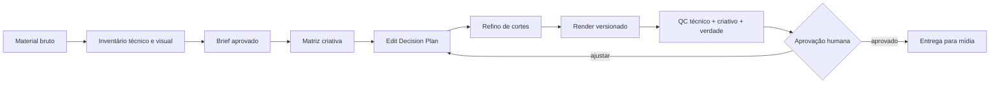

# Edição de Mídia — O Segredo da Roça

Repositório operacional para **organizar, editar, variar e revisar imagens e vídeos de mídia paga do O Segredo da Roça**, com foco inicial em criativos para Meta Ads e em diversidade criativa material, rastreável e revisável.

Este repositório não é uma biblioteca de “efeitos de IA” nem um gerenciador de campanhas. Ele funciona como uma **bancada de produção editorial e técnica**: transforma material bruto + briefing + fatos aprovados em peças versionadas, reproduzíveis e prontas para validação humana.

## Objetivo

Criar um fluxo único de trabalho para que material bruto, decisões criativas, planos de edição, renders e QC permaneçam conectados sem perder origem, intenção ou governança.

Entregáveis esperados:

- inventário do material bruto;
- briefing estruturado por peça;
- matriz de conceitos, hooks, execuções e formatos;
- plano de edição legível por humano e máquina;
- cortes e variantes de imagem/vídeo;
- controle de versão dos renders;
- QC técnico, criativo e de verdade/compliance;
- registro de dependências e ferramentas utilizadas.

## O que este repositório é

- Uma **bancada de edição de imagem e vídeo** para mídia do O Segredo da Roça.
- Uma camada de método entre material bruto e entrega de criativos.
- Um espaço para organizar diversidade criativa sem perder rastreabilidade.
- Um lugar para testar componentes open source de forma modular, sem acoplar a operação inteira a um único editor.
- Um repositório de trabalho em que mídia pesada, arquivos sensíveis e renders ficam fora do Git por padrão.

## O que este repositório não é

- Não é gerenciador de campanhas.
- Não publica anúncios automaticamente.
- Não altera orçamento, público, pixel, evento, conta ou posicionamento.
- Não inventa claims, preço, prazo, promoção, garantia ou prova social.
- Não tenta reverse-engineerizar o algoritmo da Meta.
- Não transforma pequenas mudanças cosméticas em “novos conceitos”.

## Princípio Andromeda

A documentação pública de engenharia da Meta descreve Andromeda como um sistema de **ads retrieval** criado para operar com um universo muito maior de criativos e melhorar personalização e eficiência na recuperação de candidatos de anúncio.

A tradução operacional adotada aqui é simples: **diversidade criativa precisa ser material e rastreável**.

Trocar apenas cor, legenda ou detalhe de acabamento não deve ser contado automaticamente como novo conceito. Variações úteis podem diferir em:

- tese/ângulo;
- hook e cena de abertura;
- ordem narrativa;
- demonstração/prova;
- protagonista ou objeto central;
- ritmo e densidade de corte;
- linguagem visual;
- duração;
- CTA;
- proporção e enquadramento.

Fonte primária: https://engineering.fb.com/2024/12/02/production-engineering/meta-andromeda-advantage-automation-next-gen-personalized-ads-retrieval-engine/

## Fluxo operacional



Regra da casa: **base primeiro, estrutura depois, inteligência por último**.

## Arquitetura do repositório

```text
.
├── README.md
├── AGENTS.md
├── CLAUDE.md
├── THIRD_PARTY.md
├── .gitignore
├── docs/
│   ├── ANDROMEDA.md
│   ├── WORKFLOW.md
│   ├── PIPELINE.md
│   ├── QC.md
│   └── RESEARCH_UPSTREAMS.md
├── scripts/
│   ├── media_probe.py
│   └── contact_sheet.py
├── templates/
│   ├── brief.example.yaml
│   ├── edit-plan.example.yaml
│   ├── pipeline.example.yaml
│   └── variant-matrix.example.md
└── media/
    └── README.md
```

## Stack modular recomendada

A arquitetura prioriza componentes pequenos e substituíveis em vez de clonar uma aplicação inteira.

| Camada | Ferramenta | Uso | Decisão atual |
|---|---|---|---|
| Motor | FFmpeg | corte, crop, scale, concat, áudio, render | **base** |
| Indexação | PySceneDetect | detecção de cenas/cortes | **adotar quando necessário** |
| Transcrição | OpenAI Whisper | fala + timestamps | **adotar quando necessário** |
| Corte inicial | auto-editor | silêncio/movimento e export de timeline | **adotar de forma assistida** |
| Visão leve | MediaPipe | rosto/pose/objetos, apoio a reframe | **opcional** |
| Segmentação | SAM 2 | isolamento/tracking de objetos em vídeo | **opcional pesado** |
| Fundo | rembg | remoção de fundo | **opcional; checar licença do modelo** |
| Arquitetura agêntica | agentic-video-editor | Director → Refiner → Editor → Reviewer | **padrão arquitetural incorporado** |
| Laboratório de edição agêntica | ForwrdCut | shots, hooks, EDP, reframe, captions, QC | **padrões incorporados; sem clone integral** |
| Editor open source | OpenCut | futura API/plugin/MCP/headless | **observar** |
| Render programático | Remotion | vídeo por código/React | **avaliar caso a caso por licença** |
| Corte humano rápido | LosslessCut | rough cut sem recompressão | **ferramenta externa útil** |

A avaliação detalhada fica em [`docs/RESEARCH_UPSTREAMS.md`](docs/RESEARCH_UPSTREAMS.md) e as referências/licenças em [`THIRD_PARTY.md`](THIRD_PARTY.md).

## Padrões incorporados

Sem importar aplicações inteiras, esta bancada absorve padrões úteis de projetos maduros:

- **ForwrdCut:** contact sheet antes da edição, trabalho não destrutivo, Edit Decision Plan, QC do render e organização de variantes;
- **agentic-video-editor:** separação `Preprocess → Director → Trim Refiner → Editor → Reviewer`, retry orientado por feedback e versionamento;
- **Remotion Skills:** separação modular entre metadata, captions e rendering, útil para manter componentes substituíveis.

Também existem duas ferramentas pequenas em `scripts/`, apoiadas por FFmpeg/FFprobe:

```bash
python scripts/media_probe.py media/source --out media/work/footage-index.json --hash
python scripts/contact_sheet.py media/source/video.mp4 --out media/contact-sheets/video.png
```

## Como começar uma peça

1. Mantenha o arquivo original intacto em armazenamento aprovado; se trabalhar localmente, use `media/source/` fora do Git.
2. Rode o inventário técnico e gere contact sheets dos vídeos candidatos.
3. Copie `templates/brief.example.yaml` para um arquivo de trabalho e preencha somente fatos confirmados.
4. Inventarie o material antes de propor cortes.
5. Feche a matriz `conceito × hook × execução × formato`.
6. Gere um `edit-plan` antes do render quando houver mais de uma variante ou edição não trivial.
7. Renderize versões sem destruir a fonte.
8. Execute o QC descrito em `docs/QC.md` e registre o que mudou entre versões.
9. Só após aprovação humana a peça sai desta bancada para mídia.

## Convenção de nomes

Preferir nomes rastreáveis:

```text
<produto-ou-linha>__c<conceito>__h<hook>__e<execucao>__<formato>__v<versao>.<ext>
```

Exemplo neutro:

```text
produto-a__c02__h01__e03__9x16__v02.mp4
```

Evitar nomes como `final_final_agora-vai-3.mp4`.

## Governança

- Fonte bruta é imutável.
- Ausência de dado não vira fato.
- Edição não cria verdade comercial.
- Toda peça deve conseguir responder: **de qual material veio, qual conceito executa e o que mudou nesta versão?**
- Nenhum token, chave, `.env`, credencial ou dado pessoal entra no Git.
- Contexto pessoal não pertence a este repositório.
- Ações externas irreversíveis e qualquer alteração de campanha dependem de validação humana explícita.

## Estado atual

**Base operacional preparada para receber material do O Segredo da Roça.** O próximo passo é executar um lote real pelo ciclo `brief → inventário → matriz criativa → EDP → render → QC → aprovação` e ajustar o método apenas onde a operação mostrar necessidade real.
