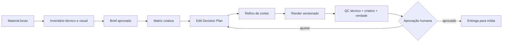

# Edição de Mídia — O Segredo da Roça

Repositório operacional para **organizar, editar, variar e revisar imagens e vídeos de mídia paga do O Segredo da Roça**, com foco inicial em criativos para Meta Ads e em diversidade criativa material, rastreável e revisável.

Este repositório não é uma biblioteca de “efeitos de IA” nem um gerenciador de campanhas. Ele funciona como uma **bancada de produção editorial e técnica**: transforma material bruto + briefing + fatos aprovados em peças versionadas, reproduzíveis e prontas para validação humana.

## Comece aqui

- [Como usar (operador)](COMO-USAR.md)
- [Máquina de edição: etapas × scripts × agentes × skills](docs/MAQUINA_DE_EDICAO.md)
- [Padrão editorial OSDR](docs/PADRAO_EDICAO_OSDR.md) e [templates por formato](templates/osdr-formats.json)
- [Especificações Meta e área segura](docs/META_SPECS.md)
- [Instalação e comandos](docs/SETUP.md)

Implementado e testado com mídia sintética: inventário, contact sheet, conversão EDP → plano de render, render de cortes sequenciais com FFmpeg, legenda segmentada no padrão OSDR, QC técnico por template, validação de registros, auditoria de diversidade Andromeda e pacote de handoff. Seis agentes e sete skills em `.claude/` operam esses scripts com gate humano em toda saída.

## Objetivo

Criar um fluxo único de trabalho para que material bruto, decisões criativas, planos de edição, renders e QC permaneçam conectados sem perder origem, intenção ou governança.

Entregáveis esperados:

- inventário do material bruto;
- briefing estruturado por peça;
- matriz de conceitos, hooks, execuções e formatos;
- plano de edição legível por humano e máquina;
- cortes e variantes de imagem/vídeo;
- controle de versão dos renders;
- QC técnico, criativo e de verdade/compliance;
- registro de dependências e ferramentas utilizadas.

## O que este repositório é

- Uma **bancada de edição de imagem e vídeo** para mídia do O Segredo da Roça.
- Uma camada de método entre material bruto e entrega de criativos.
- Um espaço para organizar diversidade criativa sem perder rastreabilidade.
- Um lugar para testar componentes open source de forma modular, sem acoplar a operação inteira a um único editor.
- Um repositório de trabalho em que mídia pesada, arquivos sensíveis e renders ficam fora do Git por padrão.

## O que este repositório não é

- Não é gerenciador de campanhas.
- Não publica anúncios automaticamente.
- Não altera orçamento, público, pixel, evento, conta ou posicionamento.
- Não inventa claims, preço, prazo, promoção, garantia ou prova social.
- Não tenta reverse-engineerizar o algoritmo da Meta.
- Não transforma pequenas mudanças cosméticas em “novos conceitos”.

## Princípio Andromeda

A documentação pública de engenharia da Meta descreve Andromeda como um sistema de **ads retrieval** criado para operar com um universo muito maior de criativos e melhorar personalização e eficiência na recuperação de candidatos de anúncio.

A tradução operacional adotada aqui é simples: **diversidade criativa precisa ser material e rastreável**.

Trocar apenas cor, legenda ou detalhe de acabamento não deve ser contado automaticamente como novo conceito. Variações úteis podem diferir em:

- tese/ângulo;
- hook e cena de abertura;
- ordem narrativa;
- demonstração/prova;
- protagonista ou objeto central;
- ritmo e densidade de corte;
- linguagem visual;
- duração;
- CTA;
- proporção e enquadramento.

Fonte primária: https://engineering.fb.com/2024/12/02/production-engineering/meta-andromeda-advantage-automation-next-gen-personalized-ads-retrieval-engine/

## Fluxo operacional



Regra da casa: **base primeiro, estrutura depois, inteligência por último**.

## Arquitetura do repositório

```text
.
├── README.md · COMO-USAR.md · AGENTS.md · CLAUDE.md · THIRD_PARTY.md
├── Makefile · requirements.txt · .gitignore · .github/workflows/test.yml
├── docs/
│   ├── MAQUINA_DE_EDICAO.md · PADRAO_EDICAO_OSDR.md · META_SPECS.md
│   ├── SETUP.md · PIPELINE.md · WORKFLOW.md · QC.md · ANDROMEDA.md
│   ├── LEARNING_LOOP.md · MEASUREMENT_CONTRACT.md
│   └── ARCHITECTURE_DECISION.md · TOOL_SELECTION_2026-09.md · RESEARCH_UPSTREAMS.md
├── schemas/            creative-variant · performance-observation (JSON Schema)
├── scripts/
│   ├── media_probe.py · contact_sheet.py          # inventário
│   ├── edp_to_render_plan.py · render_plan.py     # EDP → plano → render
│   ├── caption_segments.py                        # legenda 3–5 palavras + SRT
│   ├── qc_render.py · diversity_check.py          # QC por template e diversidade
│   ├── handoff_pack.py · validate_records.py      # handoff e registros
│   └── transcribe_local.py                        # adapter opcional
├── templates/
│   ├── osdr-formats.json                          # templates editoriais por formato
│   ├── brief · edit-plan · pipeline (YAML) · render-plan (JSON)
│   ├── creative-ledger · performance-observations (JSONL)
│   └── variant-matrix.example.md
├── tests/
├── media/README.md                                # mídia fica fora do Git
└── .claude/
    ├── agents/   preprocessador · diretor-criativo · refinador-de-corte · renderer · revisor-qc · guardiao-da-verdade
    └── skills/   arquiteto-de-midia · inventariar-material · planejar-edicao · renderizar-corte · qc-render · auditar-diversidade · handoff-midia
```

## Stack modular recomendada

A arquitetura prioriza componentes pequenos e substituíveis em vez de clonar uma aplicação inteira.

| Camada | Ferramenta | Uso | Decisão atual |
|---|---|---|---|
| Motor | FFmpeg | corte, crop, scale, concat, áudio, render | **base** |
| Indexação | PySceneDetect | detecção de cenas/cortes | **adotar quando necessário** |
| Transcrição | OpenAI Whisper | fala + timestamps | **adotar quando necessário** |
| Corte inicial | auto-editor | silêncio/movimento e export de timeline | **adotar de forma assistida** |
| Visão leve | MediaPipe | rosto/pose/objetos, apoio a reframe | **opcional** |
| Segmentação | SAM 2 | isolamento/tracking de objetos em vídeo | **opcional pesado** |
| Fundo | rembg | remoção de fundo | **opcional; checar licença do modelo** |
| Arquitetura agêntica | agentic-video-editor | Director → Refiner → Editor → Reviewer | **padrão arquitetural incorporado** |
| Laboratório de edição agêntica | ForwrdCut | shots, hooks, EDP, reframe, captions, QC | **padrões incorporados; sem clone integral** |
| Editor open source | OpenCut | futura API/plugin/MCP/headless | **observar** |
| Render programático | Remotion | vídeo por código/React | **avaliar caso a caso por licença** |
| Corte humano rápido | LosslessCut | rough cut sem recompressão | **ferramenta externa útil** |

A avaliação detalhada fica em [`docs/RESEARCH_UPSTREAMS.md`](docs/RESEARCH_UPSTREAMS.md) e as referências/licenças em [`THIRD_PARTY.md`](THIRD_PARTY.md).

## Padrões incorporados

Sem importar aplicações inteiras, esta bancada absorve padrões úteis de projetos maduros:

- **ForwrdCut:** contact sheet antes da edição, trabalho não destrutivo, Edit Decision Plan, QC do render e organização de variantes;
- **agentic-video-editor:** separação `Preprocess → Director → Trim Refiner → Editor → Reviewer`, retry orientado por feedback e versionamento;
- **Remotion Skills:** separação modular entre metadata, captions e rendering, útil para manter componentes substituíveis.

Ciclo executável de uma peça (detalhes em `docs/MAQUINA_DE_EDICAO.md`):

```bash
make check                                                     # testes, validação, diversidade
python scripts/media_probe.py media/source --out media/work/footage-index-v01.json --hash
python scripts/contact_sheet.py media/source/video.mp4 --out media/contact-sheets/video.png
python scripts/edp_to_render_plan.py media/work/peca.edit-plan.yaml --out media/work/peca.render-plan.json
python scripts/render_plan.py media/work/peca.render-plan.json --source-root media/source --out media/renders/peca__v01.mp4 --execute
python scripts/caption_segments.py media/work/peca.transcript.json --out media/work/peca.legenda.json --srt media/work/peca.legenda.srt
python scripts/qc_render.py media/renders/peca__v01.mp4 --template meta-ad --out media/renders/peca__v01.qc.json
python scripts/diversity_check.py media/work/ledger.jsonl
python scripts/handoff_pack.py media/work/ledger.jsonl <creative_id> --objective "..." --approved-by "..." --qc-report media/renders/peca__v01.qc.json
```

## Como começar uma peça

1. Mantenha o arquivo original intacto em armazenamento aprovado; se trabalhar localmente, use `media/source/` fora do Git.
2. Rode o inventário técnico e gere contact sheets dos vídeos candidatos.
3. Copie `templates/brief.example.yaml` para um arquivo de trabalho e preencha somente fatos confirmados.
4. Inventarie o material antes de propor cortes (`inventariar-material`).
5. Escolha o template em `templates/osdr-formats.json` e feche a matriz `conceito × hook × execução × formato` (`planejar-edicao`).
6. Gere um `edit-plan` antes do render e cadastre a variante no ledger com hipótese.
7. Renderize versões sem destruir a fonte; segmente a legenda quando houver fala (`renderizar-corte`).
8. Execute o QC por template e o padrão OSDR (`qc-render`), audite a diversidade do lote (`auditar-diversidade`).
9. Só após aprovação humana registrada a peça sai desta bancada para mídia (`handoff-midia`).
10. Quando houver dados de veiculação, registre observações comparáveis e decida `escalar`, `iterar`, `pausar` ou `inconclusivo` (`docs/LEARNING_LOOP.md`).

## Convenção de nomes

Preferir nomes rastreáveis:

```text
<produto-ou-linha>__c<conceito>__h<hook>__e<execucao>__<formato>__v<versao>.<ext>
```

Exemplo neutro:

```text
produto-a__c02__h01__e03__9x16__v02.mp4
```

Evitar nomes como `final_final_agora-vai-3.mp4`.

## Governança

- Fonte bruta é imutável.
- Ausência de dado não vira fato.
- Edição não cria verdade comercial.
- Toda peça deve conseguir responder: **de qual material veio, qual conceito executa e o que mudou nesta versão?**
- Nenhum token, chave, `.env`, credencial ou dado pessoal entra no Git.
- Contexto pessoal não pertence a este repositório.
- Ações externas irreversíveis e qualquer alteração de campanha dependem de validação humana explícita.

## Estado atual

**Máquina de edição executável de ponta a ponta, com padrão editorial OSDR e gate humano.** O próximo passo é colocar um lote real em `media/source/` e rodar o ciclo `inventário → conceitos → EDP → render → legenda → QC → diversidade → aprovação → handoff`, ajustando o método só onde a operação mostrar necessidade.
